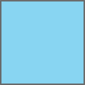

Note this mixin rewrites all position properties.


#### SCSS
```scss
.box {
  @include absolute();
}
```

CSS
```css
.box {
  position: absolute;
  top: 0;
  left: 0;
  right: inherit;
  bottom: inherit;
}
```


#### SCSS
```scss
.box {
  @include absolute(0);
}
```

##### CSS
```css
.box {
  position: absolute;
  top: 0;
  left: inherit;
  right: inherit;
  bottom: inherit;
}
```


#### SCSS
```scss
.box {
  @include absolute(0, 0);
}
```

##### CSS
```css
.box {
  position: absolute;
  top: 0;
  left: inherit;
  right: 0;
  bottom: inherit;
}
```


#### SCSS
```scss
.box {
  @include absolute(0, 0, 0);
}
```

##### CSS
```css
.box {
  position: absolute;
  top: 0;
  left: inherit;
  right: 0;
  bottom: 0;
}
```



#### SCSS
```scss
.box {
  @include absolute(0, 0, 0, 0);
}
```

##### CSS
```css
.box {
  position: absolute;
  top: 0;
  left: 0;
  right: 0;
  bottom: 0;
}
```


#### SCSS
```scss
.box {
  @include absolute($top: 0);
}
```

##### CSS
```css
.box {
  position: absolute;
  top: 0;
  left: inherit;
  right: inherit;
  bottom: inherit;
}
```


#### SCSS
```scss
.box {
  @include absolute($left: 0);
}
```

##### CSS
```css
.box {
  position: absolute;
  top: inherit;
  left: 0;
  right: inherit;
  bottom: inherit;
}
```


#### SCSS
```scss
.box {
  @include absolute($right: 0);
}
```

##### CSS
```css
.box {
  position: absolute;
  top: inherit;
  left: inherit;
  right: 0;
  bottom: inherit;
}
```


#### SCSS
```scss
.box {
  @include absolute($bottom: 0);
}
```

##### CSS
```css
.box {
  position: absolute;
  top: inherit;
  left: inherit;
  right: inherit;
  bottom: 0;
}
```


#### SCSS
```scss
.box {
  @include absolute(0, $bottom: 0);
}
```

##### CSS
```css
.box {
  position: absolute;
  top: 0;
  left: inherit;
  right: inherit;
  bottom: 0;
}
```


#### SCSS
```scss
.box {
  @include absolute(0, $right: 0);
}
```

##### CSS
```css
.box {
  position: absolute;
  top: 0;
  left: inherit;
  right: 0;
  bottom: inherit;
}
```
